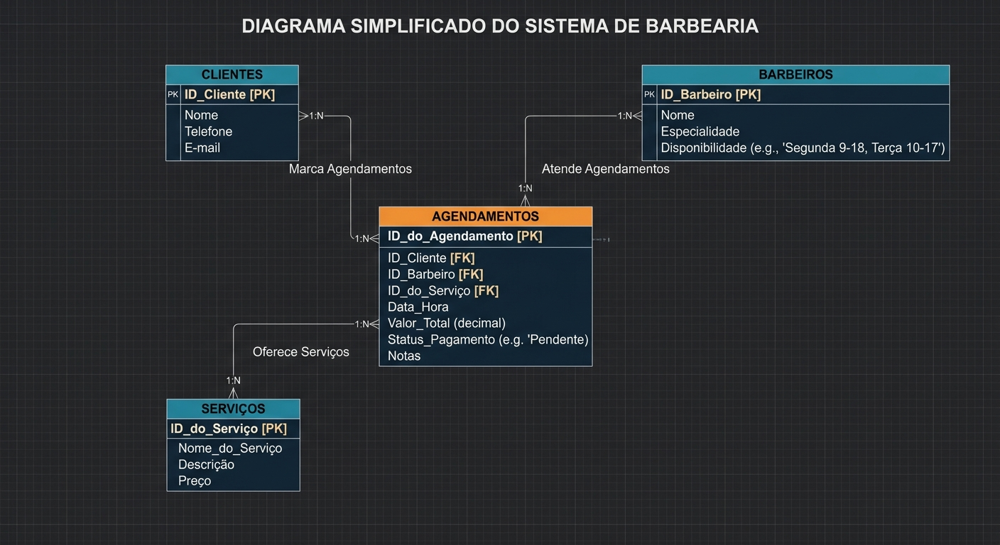

# Sistema de Agendamento - Barbearia Navalha & Estilo

Este repositório contém a aplicação web desenvolvida em Flask para gerenciamento de agendamentos da Barbearia Navalha & Estilo.

## Integrantes do Grupo
* **Arthur Ignacio Delia**
* **Gustavo Campos Ferreira Da Cruz**
* **Pedro Henrique Guedes Lima**
* **Rafael Fernandes Silva**

## Arquitetura
* `database.py` — instância central do SQLAlchemy.
* `models.py` — tabelas do ORM (Cliente, Barbeiro, Serviço, Agendamento), baseadas no DER.
* `routes.py` — Blueprint com as rotas e regras de negócio (CRUD + filtro).
* `app.py` — ponto de entrada: configuração e inicialização do servidor.

## Como rodar
```
pip install flask flask_sqlalchemy
python app.py
```
O banco `barbearia.db` é criado automaticamente na primeira execução (não é versionado — veja `.gitignore`).

## Diagrama de Entidade-Relacionamento (DER)

